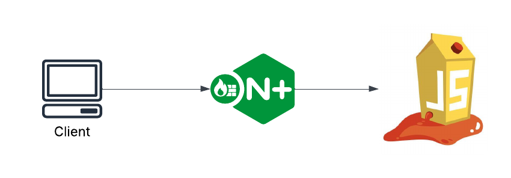
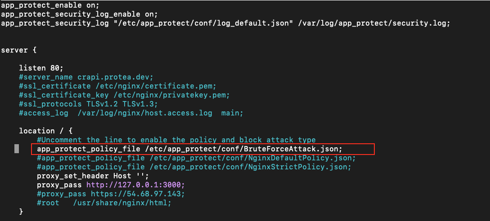

WAF Test Plan
=============

Each directory will correspond to the attack type used to exploit the application we want to protect.
Each directory will contain test client vectors triggering the correponding attack type, in addition to the App Protect policy used to mitigate the attack. 

Prerequisites
~~~~~~~~~~~~~

- NGINX App Protect Version 4

- A backend application (We use the juicebox application for testing)

Topology
~~~~~~~~

Running Client Attacks
~~~~~~~~~~~~~~~~~~~~~~

Run the client attack script inside the attack type directory. For example, run the brute force attack.

.. code:: shell 

	cd Brute_Force_Attack
	/bin/bash client_attacks <NGINX-ENDPOINT>

Applying NGINX App Protect Policies
~~~~~~~~~~~~~~~~~~~~~~~~~~~~~~~~~~~

Reference the policy inside the nginx config and reload.

.. code:: shell

	cp Brute_Force_Attack/BruteForceAttack.json /etc/app-protect/conf 

 
.. code:: shell
	nginx -s reload

DONE
~~~~

