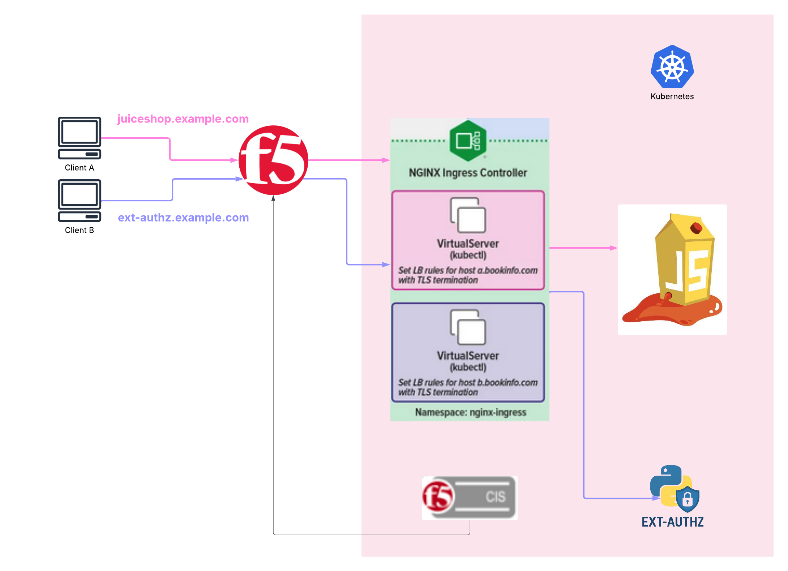
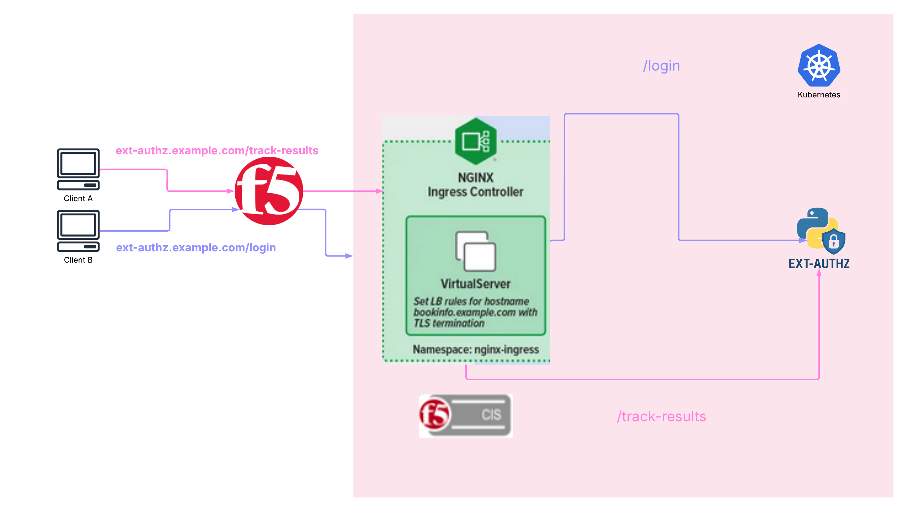
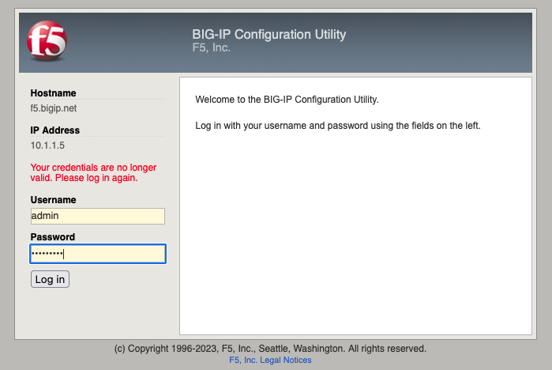
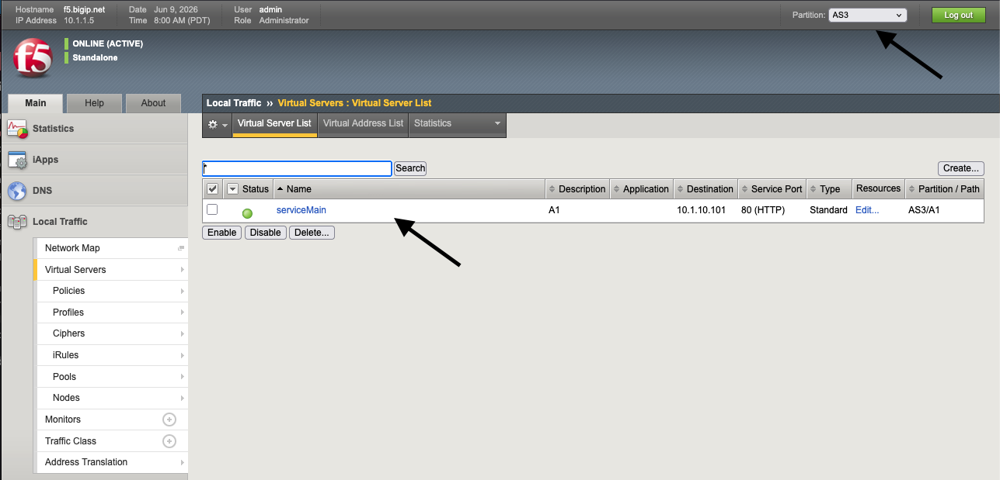
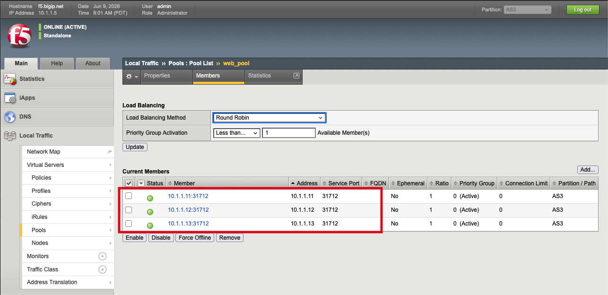
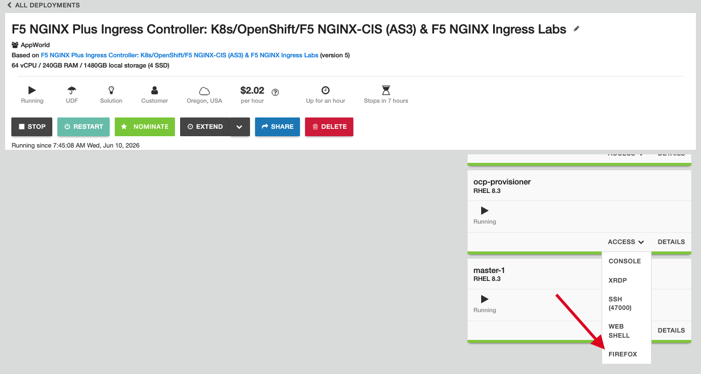
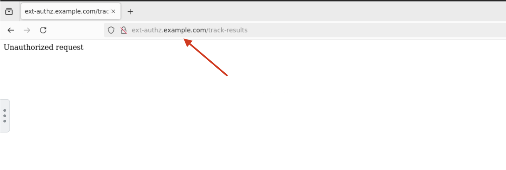
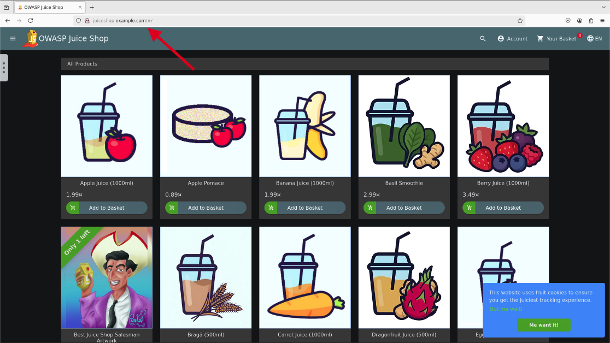
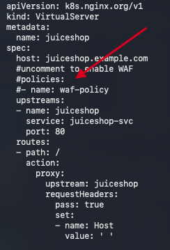
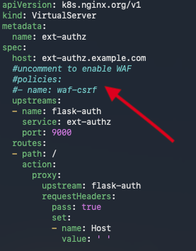

F5 WAF for NGINX in Kubernetes
==============================

Each directory will correspond to the attack type used to exploit the application we want to protect.
Each directory will contain test client vectors triggering the correponding attack type, in addition to the App Protect policy used to mitigate the attack. 

Prerequisites
~~~~~~~~~~~~~
- F5 WAF for NGINX Plus Ingress Controller
- A backend applications (We will segment WAF polcies with three application deployments)

Topology
~~~~~~~~

In this lab, we will explore two topologies. The first topology demonstrates F5 WAF policy segmentation by 
Virtual Server (FQDN), where each application deployment is safeguarded by a dedicated WAF policy. We will 
run 2 application deplpoyments (JuiceShop and external-authz python application)

The second topology focuses on segmenting WAF policies by path URI rather than by Virtual Server (FQDN). This approach provides stricter policy segmentation, requiring application owners to expose only Layer 7 routes within the cluster. Unique WAF policies can then be applied directly to these specific routes.

Getting Started with the BIG-IP
===============================
.. note::
   These next steps will guide you through reviewing the LTM policy for routing all traffic to the cluster. Nothing will be provioned for the
   BIG-IP in this lab.

   You will be using the BIG-IP in the TMUI   

1. Open your browser tab with the BIG-IP GUI and sign in using the BIG-IP username and password

**Username: admin**

**Password: F5site02@**

2. You should be logged into the BIG-IP now, switch to the AS3 context and navigate to Local Traffic > 
Virtual Server. You should see the serviceMain virtual server in green status.

3. Navigate to Pools and select web_pool, then select the members tab. As we are running BIG-IP in NodePort mode, the pool members correspond to the Kubernetes cluster nodes, while the ports map to the NodePort of the service being exposed—in this case, the NGINX Ingress Controller. We will confirm this configuration after setting up the NGINX Ingress Controller in Kubernetes. 

Setting up F5 WAF with NGINX Ingress Controller
~~~~~~~~~~~~~~~~~~~~~~~~~~~~~~~~~~~~~~~~~~~~~~~

We will be setting up our Kubernetes cluster from kube-master1.
SSH >> kube-master1 

First lets verify that F5 NGINX Ingress Controller is running in our cluster. 

.. code:: shell

	kubectl get pods -o wide -n nginx-ingress
	kubectl describe pod $(kubectl get pod -l app=nginx-ingress -n nginx-ingress -o jsonpath={.items..metadata.name}) -n nginx-ingress | grep Image

The output indicates the image we are deploying must include F5 WAF with NGINX Plus Ingress Controller. 
Now we will check the NodePort service exposing NGINX Ingress Controller.

.. code:: shell 

	kubectl get svc -o wide -n nginx-ingress

The NodePort of the service will align with the pool members configured in BIG-IP.

Deploying the Applications
~~~~~~~~~~~~~~~~~~~~~~~~~~

Verify the juiceshop and ext-authz applications are runnning

.. code:: shell

	kubectl get pods -o wide

Now expose both applications with Kubernetes Ingress Resources

.. code:: shell

	kubectl ~/agilitydocs/docs/class1/kubernetes/app-protect-waf/ingress-juiceshop.yaml
	kubectl ~/agilitydocs/docs/class1/kubernetes/app-protect-waf/ingress-ext-authz.yaml

Verify that the Ingress Resources are applied correctly and valid

.. code:: shell	
    
        kubectl get ing

	NAME                CLASS   HOSTS                   ADDRESS   PORTS   AGE
	ext-authz-ingress   nginx   ext-authz.example.com             80      3h23m
	juiceshop           nginx   juiceshop.example.com             80      3h8m

Running the Firefox Browser and Connect to Applications
~~~~~~~~~~~~~~~~~~~~~~~~~~~~~~~~~~~~~~~~~~~~~~~~~~~~~~~

Initiating the firefox browser will require to SSH into the ocp-provisioner. If you are using webshell, run "su -- cloud-user".

Now we can open firefox from the ocp-provisioner.

Enter **ext-authz.example.com** in the firefox address bar. We can see the application is telling us we are not authorized to access any data.
Probably because we do not valid session cookie token.

Enter **juiceshop.example.com** in the firefox address bar

   

 

Attacking the JuiceShop Application
~~~~~~~~~~~~~~~~~~~~~~~~~~~~~~~~~~~
Now we will run attack vectors against both applications
Once you SSH into kube-master1, run SQL injection attacks against the juiceshop application.

.. code:: shell

	cd ~/agilitydocs/docs/class1/kubernetes/app-protect-waf/NAP-Attack-Demos/SQL_Injection
	/bin/bash client_attacks juiceshop.example.com

	**Output**
	{
    "status": "success",
    "data": [
        {
            "id": 1,
            "name": "admin@juice-sh.op",
            "description": "0192023a7bbd73250516f069df18b500",
            "price": "4",
            "deluxePrice": "5",
            "image": "6",
            "createdAt": "7",
            "updatedAt": "8",
            "deletedAt": "9"
        },
        {
            "id": 2,
            "name": "jim@juice-sh.op",
            "description": "e541ca7ecf72b8d1286474fc613e5e45",
            "price": "4",
            "deluxePrice": "5",
            "image": "6",
            "createdAt": "7",
            "updatedAt": "8",
            "deletedAt": "9"
        },
        {
            "id": 3,
            "name": "bender@juice-sh.op",
            "description": "0c36e517e3fa95aabf1bbffc6744a4ef",
            "price": "4",
            "deluxePrice": "5",
            "image": "6",
            "createdAt": "7",
            "updatedAt": "8",
            "deletedAt": "9"
        },
        {
            "id": 4,
            "name": "bjoern.kimminich@gmail.com",
            "description": "6edd9d726cbdc873c539e41ae8757b8c",
            "price": "4",
            "deluxePrice": "5",
            "image": "6",
            "createdAt": "7",
            "updatedAt": "8",
            "deletedAt": "9"
        },	

We are able to extract all user information in json format from the juiceshop database via SQL injection.

Now we will run a remote file inclusion attack #Poison Null Type HTTP injection, to extract information from the application not intended for users to see.

.. code:: shell
	
	cd ~/agilitydocs/docs/class1/kubernetes/app-protect-waf/NAP-Attack-Demos/Remote_File_Inclusion
	/bin/bash client_attacks juiceshop.example.com

	**Output**
	{
  "name": "juice-shop",
  "version": "6.2.0-SNAPSHOT",
  "description": "An intentionally insecure JavaScript Web Application",
  "homepage": "http://owasp-juice.shop",
  "author": "Björn Kimminich <bjoern.kimminich@owasp.org> (https://kimminich.de)",
  "contributors": [
    "Björn Kimminich",
    "Jannik Hollenbach",
    "Aashish683",
    "greenkeeper[bot]",
    "MarcRler",
    "agrawalarpit14",
    "Scar26",
    "CaptainFreak",
    "Supratik Das",
    "JuiceShopBot",
    "the-pro",
    "Ziyang Li",
    "aaryan10",
    "m4l1c3",
    "Timo Pagel",
    "..."
  ],
  "private": true,
  "keywords": [
    "web security",
    "web application security",
    "webappsec",
    "owasp",
    "pentest",
    "pentesting",
    "security",
    "vulnerable",
    "vulnerability",
    "broken",
    "bodgeit"
  ],
  "dependencies": {
    "body-parser": "~1.18",
    "colors": "~1.1",
    "config": "~1.28",
    "cookie-parser": "~1.4",
    "cors": "~2.8",
    "dottie": "~2.0",
    "epilogue-js": "~0.7",
    "errorhandler": "~1.5",
    "express": "~4.16",
    "express-jwt": "0.1.3",
    "fs-extra": "~4.0",
    "glob": "~5.0",
    "grunt": "~1.0",
    "grunt-angular-templates": "~1.1",
    "grunt-contrib-clean": "~1.1",
    "grunt-contrib-compress": "~1.4",
    "grunt-contrib-concat": "~1.0",
    "grunt-contrib-uglify": "~3.2",
    "hashids": "~1.1",
    "helmet": "~3.9",
    "html-entities": "~1.2",
    "jasmine": "^2.8.0",
    "js-yaml": "3.10",
    "jsonwebtoken": "~8",
    "jssha": "~2.3",
    "libxmljs": "~0.18",
    "marsdb": "~0.6",
    "morgan": "~1.9",
    "multer": "~1.3",
    "pdfkit": "~0.8",
    "replace": "~0.3",
    "request": "~2",
    "sanitize-html": "1.4.2",
    "sequelize": "~4",
    "serve-favicon": "~2.4",
    "serve-index": "~1.9",
    "socket.io": "~2.0",
    "sqlite3": "~3.1.13",
    "z85": "~0.0"
  },

Attacking the Ext-Authz Application
~~~~~~~~~~~~~~~~~~~~~~~~~~~~~~~~~~~
As mentioned earlier, we knowthe ext authz application is using some form of authentication block unauthorized users from accessing sensitive data.
If we can hijack the session cookie, we may be able to run a CRSF (Cross Site Request Forgery) attack to bypass this.

.. code:: shell
	
	cd ~/agilitydocs/docs/class1/kubernetes/app-protect-waf/NAP-Attack-Demos/CSRF
	/bin/bash client_attacks ext-authz.example.com
	
	**Output**

	HTTP/1.1 200 OK
	Server: nginx/1.29.8
	Date: Thu, 11 Jun 2026 12:59:39 GMT
	Content-Type: text/html; charset=utf-8
	Content-Length: 47
	Connection: keep-alive	
	Set-Cookie: BIGipServer~AS3~A1~web_pool=201392394.57467.0000; path=/; Httponly

	{ 'SSN': '123-45-6789', 'Password': 'ABC123!' }
	

Oh NO!! We extract very sensitive information associated to a user! We need to set WAF policies in place to protect these applications from these high severity attacks. May Day May DAY!!!
	

Creating the JuiceShop WAF Policy
~~~~~~~~~~~~~~~~~~~~~~~~~~~~~~~~~

We need to create the WAF policy that is appropriate for the application. Because juiceshop and ext-authz are different applications with different vulnerabilities, we will create two different WAF policies.
Lets begin with creating the JuiceShop WAF policy 

.. code:: shell
	
	cd ~/agilitydocs/docs/class1/kubernetes/app-protect-waf	
	#Deploy SysLog pod for WAF Security logs. These can be exported to another UDP endpoint.
	kubectl create -f syslog.yaml
	kubectl create -f ap-log.yaml
	#Deploy the JuiceShop policy
	kubectl create -f ap-apple-uds.yaml
	kubectl create -f ap-dataguard-alarm-policy.yaml
	kubectl create -f waf.yaml

Now verify the WAF policy is valid 

.. code:: shell

	kubectl get policies.k8s.nginx.org 

Uncomment the **policies** field in the juiceshop VirtualServer and reapply

	
.. code:: shell

	$ kubectl apply -f virtual-server-juiceshop.yaml

Now run the attacks again against juiceshop application

.. code:: shell

	cd ~/agilitydocs/docs/class1/kubernetes/app-protect-waf/NAP-Attack-Demos/SQL_Injection
	/bin/bash client_attacks juiceshop.example.com
	cd ~/agilitydocs/docs/class1/kubernetes/app-protect-waf/NAP-Attack-Demos/Remote_File_Inclusion
	/bin/bash client_attacks juiceshop.example.com

	**Output**
	HTTP/1.1 200 OK
	Content-Type: text/html; charset=utf-8
	Connection: close
	Cache-Control: no-cache
	Pragma: no-cache
	Content-Length: 246
	Set-Cookie: BIGipServer~AS3~A1~web_pool=201392394.57467.0000; path=/; Httponly

	<html><head><title>Request Rejected</title></head><body>The requested URL was rejected. Please consult with your administrator.  Your support ID is: 8531163621729518412  <a href='javascript:history.back();'>[Go Back]</a></body></html>
	
We can see attacks are now blocked. You can view the blocked events in detail from the syslog pod.

.. code:: shell

	$ kubectl exec -it $(kubectl get pod -l app=syslog -o jsonpath={.items..metadata.name}) -- cat /var/log/messages

Creating the Ext-Authz WAF policy
~~~~~~~~~~~~~~~~~~~~~~~~~~~~~~~~~

As mentioned earlier, the JuiceShop WAF policy will not block CSRF attacks. It blocks base signature attacks (OWASP top 10) and safeguards sensitve information.
We will create another WAF policy that will block CSRF attacks to address the vulnerability of the ext-authz application.

.. code:: shell

	cd ~/agilitydocs/docs/class1/kubernetes/app-protect-waf 
        #Deploy the Ext-Authz WAF policy
        kubectl create -f ap-csrf.yaml
        kubectl create -f waf-csrf.yaml

Verify both WAF policies are valid

.. code:: shell

	kubectl get policies.k8s.nginx.org	

Now we can update the virtualserver exposing the ext-authz application and apply the WAF policy.

.. code:: shell

	kubectl apply -f virtual-server-ext-authz.yaml

Verify both virtualservers are valid. 

.. code:: shell

	kubectl get virtualservers.k8s.nginx.org
	**Output**
	NAME        STATE   HOST                    IP    PORTS   AGE
	ext-authz   Valid   ext-authz.example.com                 7d
	juiceshop   Valid   juiceshop.example.com                 42h

Run the CSRF attack against the ext-authz application

.. code:: shell 
	
	cd ~/agilitydocs/docs/class1/kubernetes/app-protect-waf/NAP-Attack-Demos/CSRF
	/bin/bash client_attacks ext-authz.example.com
	**Output**
	HTTP/1.1 200 OK
	Content-Type: text/html; charset=utf-8
	Connection: close
	Cache-Control: no-cache
	Pragma: no-cache
	Content-Length: 246
	Set-Cookie: BIGipServer~AS3~A1~web_pool=218169610.57467.0000; path=/; Httponly

	<html><head><title>Request Rejected</title></head><body>The requested URL was rejected	. Please consult with your administrator.  Your support ID is: 8258439757866909385  <a href='javascript:history.back();'>[Go Back]</a></body></html>
	
The request is now rejected. 

Converting ASM policies to F5 WAF for NGINX
~~~~~~~~~~~~~~~~~~~~~~~~~~~~~~~~~~~~~~~~~~~
	
	
 

DONE
~~~~

